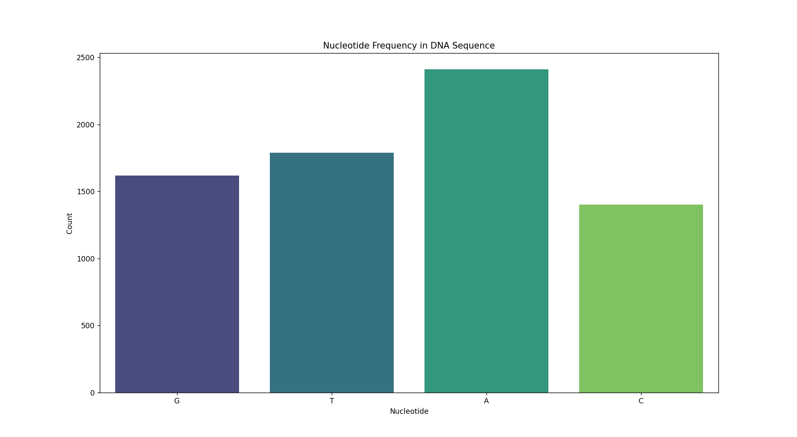
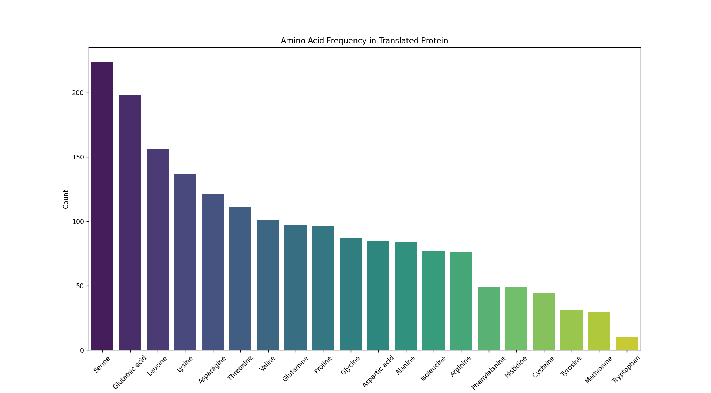

# DNA to Protein Translation (Bioinformatics Exercise)

This is a simple Python script that reads a DNA sequence from a FASTA file, calculates nucleotide frequencies, transcribes it into mRNA(messenger RNA), and translates the mRNA into a protein sequence.

## General purpose

This project simulates the biological process of gene expression by reading a DNA sequence, transcribing it into messenger RNA (mRNA), and translating that into a protein.
It shows the main steps in protein creation and lets users see how DNA turns into mRNA and then into a chain of amino acids. The program also includes simple analysis and visualizations of nucleotide and amino acid frequencies.

## Features

- Reads DNA sequence from `.fasta` file
- Counts nucleotide frequencies and displays them in a plot
- Transcribes DNA to mRNA
- Translates mRNA to a protein sequence
- Counts amino acid frequencies and displays them in a plot

## Requirements

- Python **3.7+** (tested on 3.13.3)
- pandas
- matplotlib
- seaborn
- biopython
- tabulate

## Preview

### Nucleotide Frequency Plot

### Amino Acid Frequency Plot

